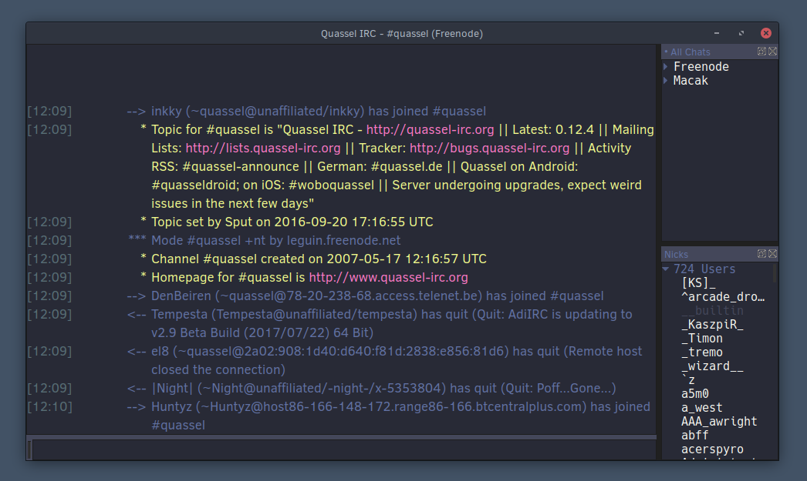

# Dracula for [Quassel](http://www.quassel-irc.org/)

> A dark theme for [Quassel](http://www.quassel-irc.org/) IRC client

## Install

All instructions can be found at [draculatheme.com/quassel](https://draculatheme.com/quassel).

## Team

This theme is maintained by the following person(s) and a bunch of [awesome contributors](https://github.com/dracula/template/graphs/contributors).

|  |
| ----------------------------------------------------------------------------------------------------------- |
| [Stephen Maxwell](https://github.com/iinkky)                                                                |

## Community

- [Twitter](https://twitter.com/draculatheme) - Best for getting updates about themes and new stuff.
- [GitHub](https://github.com/dracula/dracula-theme/discussions) - Best for asking questions and discussing issues.
- [Discord](https://draculatheme.com/discord-invite) - Best for hanging out with the community.

## Credits

This theme is a fork of the [DarkSolarized](https://gist.github.com/Zren/e91ad5197f9d6b6d410f) theme with [Dracula](https://github.com/dracula/dracula-theme) colours.

For other stylesheets see [here](http://bugs.quassel-irc.org/projects/quassel-irc/wiki/Stylesheet_Gallery).

## License

[MIT License](./LICENSE)
